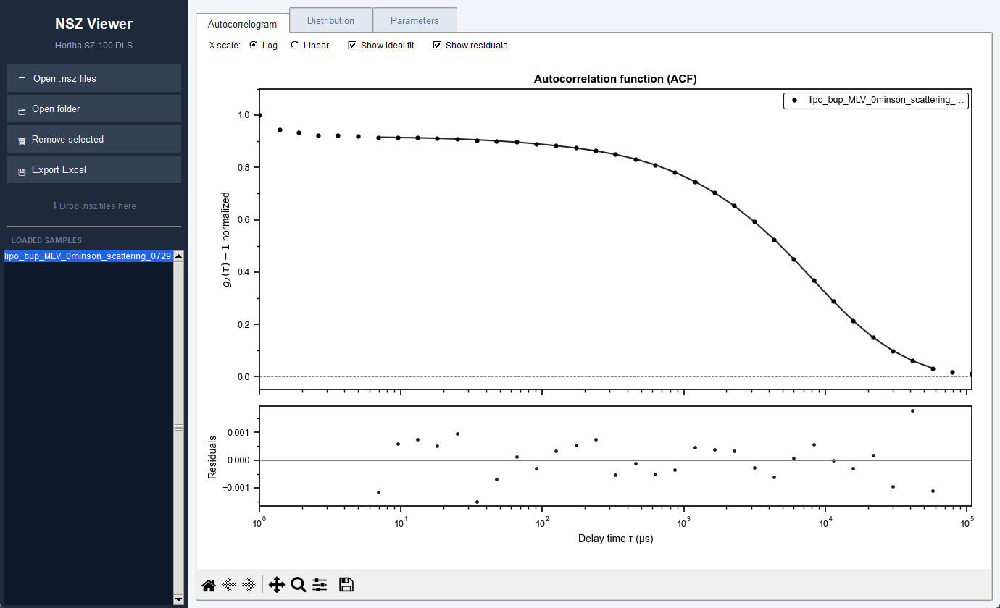
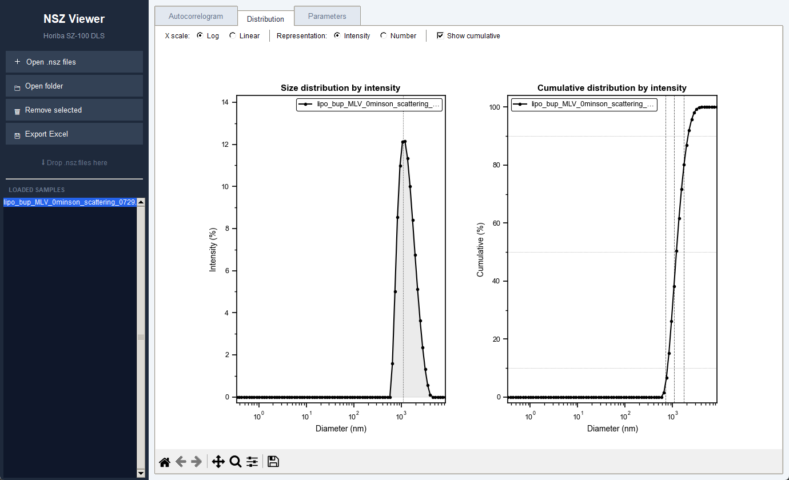

# DLS-Horiba

Desktop viewer for `.nsz` files from the **Horiba SZ-100** dynamic light scattering (DLS)
instrument. It reads the binary files directly, without the instrument software, plots the
correlation function and the particle size distribution, compares several samples, and
exports everything to Excel.

> **Unofficial.** This project is not affiliated with or endorsed by Horiba. The `.nsz`
> format was worked out by inspecting files, and the extracted values were validated against
> the CSV exported by the instrument software on a single sample (see "Validation" below). Check the results
> against your own exports before relying on them, especially with other instrument models.




## Features

- Opens `.nsz` files from a dialog, a whole folder, the command line or drag-and-drop
  (needs `tkinterdnd2`).
- Loads many samples and overlays the selected ones.
- **Autocorrelogram** tab: measured correlation function, Horiba fit and residuals. The file stores the intensity
  correlation g₂−1 (the square of the g₁ that the instrument software exports), and that is what is plotted.
- **Distribution** tab: size distribution by intensity or by number, log or linear x axis,
  optional cumulative curve.
- **Parameters** tab: date, solvent, scattering angle, wavelength, temperature, viscosity,
  refractive index, peak and mean sizes, SD, D10/D50/D90, mode, median, Z-average, PDI and span.
- **Excel export**: one `.xlsx` per sample with sheets for the ACF (data, fit, residuals),
  the intensity and number distributions and the parameters.
- **Figures**: `File → Save Figure Image (PNG, PDF, SVG)...`, `Save Figure (pickle)...` and `Edit Figure...` work on the
  plot of the active tab (a copy restyled as an Origin-like figure with the shared
  [PlotStyleKit](https://github.com/milanone/PlotStyleKit), which is also used for the on-screen plots when the repo is
  next to this one).

## Run

```
pip install -r requirements.txt
pythonw nsz_viewer.pyw [file.nsz ...]
```

`pythonw` starts it without a console window (`python` keeps one).

## Tests

```
py -m unittest discover -s tests -v
```

The helpers and the application are tested on synthetic data. The parser is tested against a real measurement and the
CSV the instrument software exported for it, kept in `example data/` (gitignored); those tests are skipped if the
files are missing.

## Validation

On one sample (a single `.nsz` and the CSV of the same measurement) the viewer matches the software for: mean, SD, mode,
Z-average and PDI; the 84-bin size distribution (frequency and cumulative); and the correlation function and its fit
(the file holds g₁², the CSV g₁; the residuals follow the same pattern but are not equal). Not verified: other
instrument models or software versions, measurements with two peaks, and the date/time (the time is read from the
measurement ID and showed `12:22:00` for a measurement that the software dates `12:22:39`).

## Notes on the format

An `.nsz` file is an OLE compound file. The viewer reads these streams:

| Stream | Content |
|---|---|
| `Object2`, `Object3` | Correlation function and its lag times (trailing baseline channels are trimmed) |
| `Object10`, `Object7` | Fit and residuals; the header holds the number of initial channels excluded from the fit |
| `Object5`, `Object4`, `Object31` | Size bins (84), intensity distribution, cumulative distribution |
| `Base1`, `Base34`, `Base38` | Calculated results, measurement parameters, sample name |

Two details matter when interpreting the values: the diameter fields (`CalcMean`, `CalcPeakPos`,
`CalcPerDiameter`, `Cum_fMean`, ...) are stored as **radii**, so the viewer multiplies them by 2;
and the PDI is taken from `Cum_fPi`, because `CalcTotalPI` does not match the software's value.

## Data

This repository contains code only: `.gitignore` excludes `*.nsz`, `*.csv`, `*.xlsx` and the `example data/` folder,
so your measurements and exports stay on your machine. The screenshots show one real measurement.

## Requirements

Python 3, numpy, matplotlib, olefile, openpyxl; `tkinterdnd2` is optional.

## License

[MIT](LICENSE)
